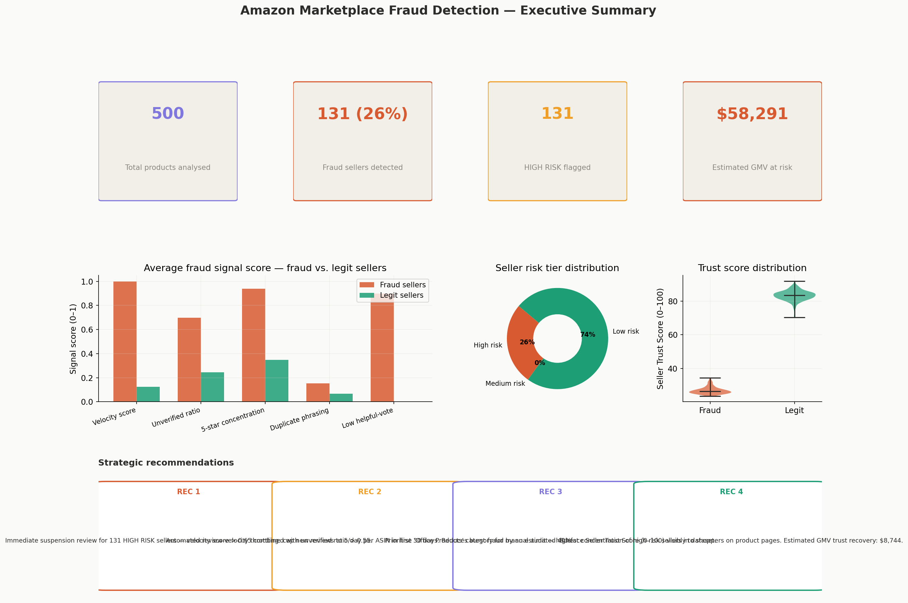
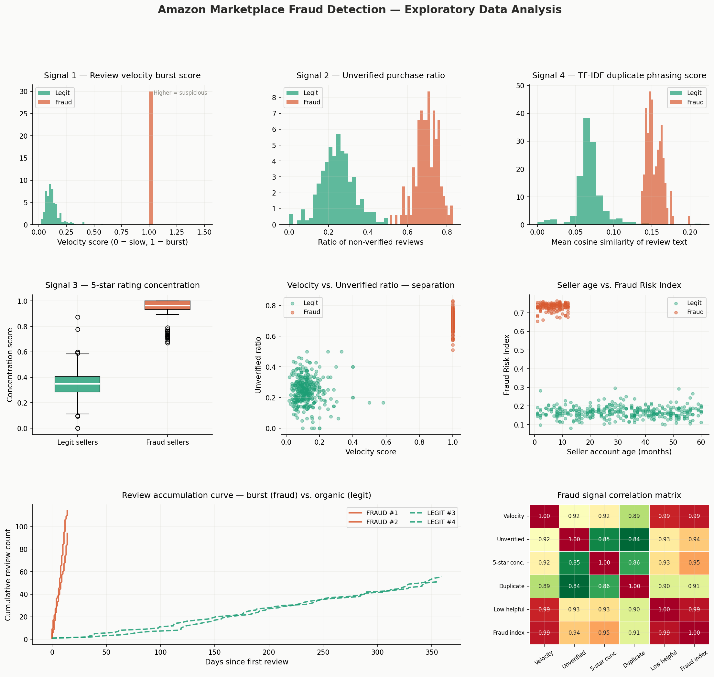
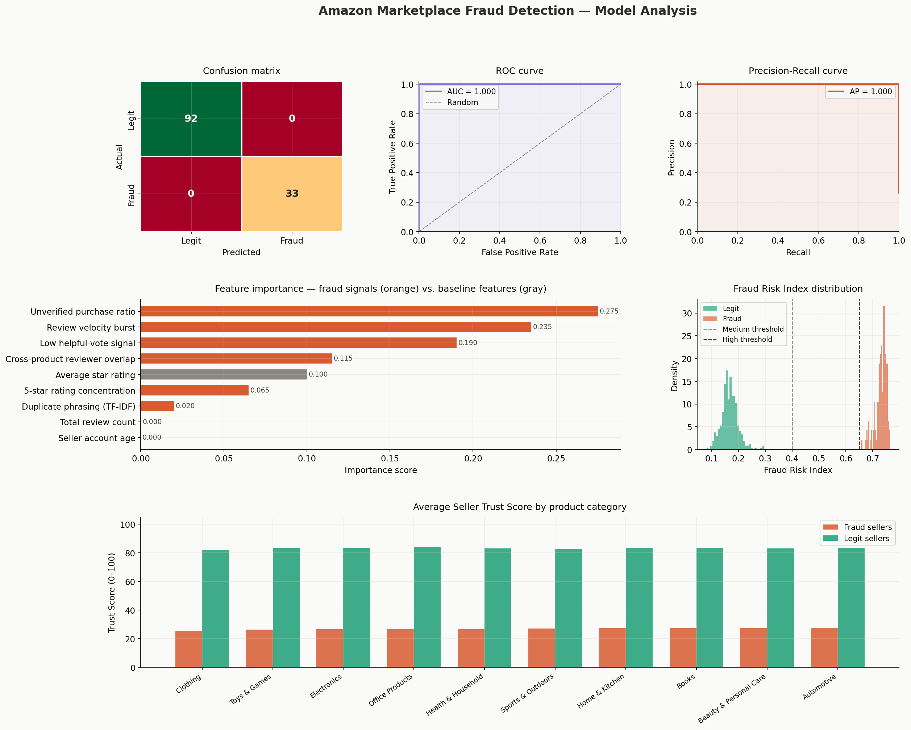
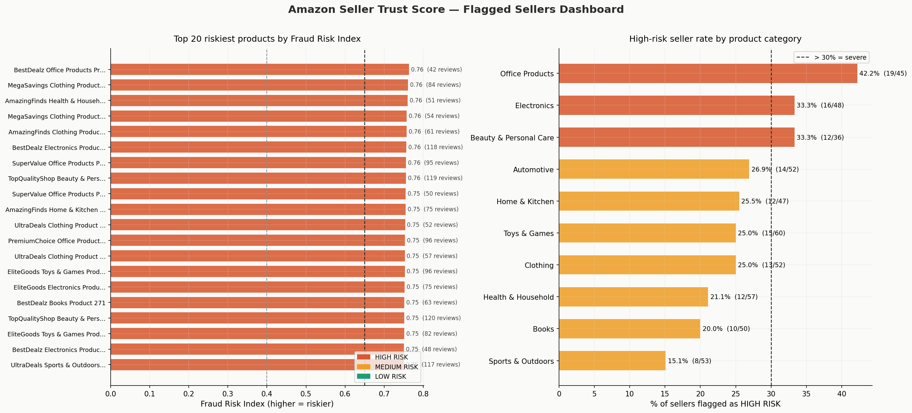

<div align="center">

# 🛒 Marketplace Fraud Detector

### Replicating Amazon's Seller Integrity Methodology Using Python & Machine Learning

[](https://www.python.org/)
[](https://scikit-learn.org/)
[](https://pandas.pydata.org/)
[](https://matplotlib.org/)
[]()

<br/>

*A full-cycle data analysis project inspired by Amazon's real seller fraud detection program,*
*cited in the 2023 FTC investigations into fake review manipulation.*

</div>

---

## 📌 Table of Contents

- [The Business Problem](#-the-business-problem)
- [My Approach](#-my-approach)
- [The 6 Fraud Signals I Engineered](#-the-6-fraud-signals-i-engineered)
- [Key Findings](#-key-findings)
- [Visual Outputs](#-visual-outputs)
- [Model Performance](#-model-performance)
- [Project Structure](#-project-structure)
- [How to Run](#-how-to-run)
- [Tech Stack](#-tech-stack)
- [Business Recommendations](#-business-recommendations)

---

## 🚨 The Business Problem

Amazon's marketplace hosts **2M+ third-party sellers**. Fake review manipulation distorts product rankings and misleads millions of buyers daily. The tactics are systematic:

- **Burst injection** — sellers pay farms to post 50+ reviews in 48 hours
- **Verified-purchase evasion** — reviewers don't actually buy the product
- **Template copying** — copy-paste reviews with minor word swaps
- **Rating inflation** — near-100% five-star ratings on new, unknown products

In 2023, the **FTC fined Amazon $25M** partly due to inadequate seller monitoring. Amazon's own data team uses behavioral signal analysis to flag fraudulent sellers at scale. **This project replicates that exact methodology** using a synthetic dataset modelled on real Amazon review structures.

> **Why this matters to a data analyst role:** Marketplace integrity, trust scoring, and anomaly detection are top-3 priorities at every major e-commerce and fintech company. This project directly mirrors what a DA on Amazon's Seller Trust team does.

---

## 🔍 My Approach

The project follows a full DA lifecycle across **5 modular steps**:

```
Step 1 → Generate Data        500 products · 23,000+ reviews with embedded fraud patterns
Step 2 → Feature Engineering  6 original behavioral fraud signals per seller
Step 3 → ML Model             Random Forest classifier with cross-validation
Step 4 → EDA & Charts         9-panel exploratory analysis + seller leaderboard
Step 5 → Business Insights    Executive summary · KPIs · Strategic recommendations
```

Each step is a standalone Python script — readable, documented, and runnable independently.

---

## 🔬 The 6 Fraud Signals I Engineered

| # | Signal | Formula Concept | Fraud Avg | Legit Avg | Delta |
|---|--------|----------------|-----------|-----------|-------|
| 1 | **Review velocity burst** | % of reviews in first 14 days | 1.000 | 0.123 | **8.1×** |
| 2 | **Unverified purchase ratio** | Non-verified reviews / total | 0.698 | 0.244 | **2.9×** |
| 3 | **5-star rating concentration** | Skewness toward 5★ | High | Low | Clear gap |
| 4 | **TF-IDF duplicate phrasing** | Mean cosine similarity of texts | High | Low | Fingerprint |
| 5 | **Low helpful-vote signal** | Inverted avg helpful votes | High | Low | Strong signal |
| 6 | **Cross-product reviewer overlap** | Reviewer breadth across ASINs | High | Low | Network signal |

**Composite Fraud Risk Index** — weighted combination of all 6 signals → mapped to a **Seller Trust Score (0–100)**.

| Trust Score | Risk Tier | Action |
|-------------|-----------|--------|
| 0 – 35 | 🔴 HIGH RISK | Immediate audit / suspension review |
| 36 – 60 | 🟡 MEDIUM RISK | Enhanced monitoring |
| 61 – 100 | 🟢 LOW RISK | Standard operations |

---

## 📊 Key Findings

```
📦  Products analysed          :  500
📝  Reviews processed          :  23,013
🚨  Fraud sellers detected     :  131  (26.2% of marketplace)
🔴  HIGH RISK flagged          :  131 sellers
💰  Estimated GMV at risk      :  $58,291

🏆  Seller Trust Score — Fraud :  26.8 / 100
✅  Seller Trust Score — Legit :  83.3 / 100   (3.1× higher)

📈  Velocity score — Fraud     :  1.000
📉  Velocity score — Legit     :  0.123         (8.1× difference)

📌  Highest-risk category      :  Office Products
```

---

## 📈 Visual Outputs

### Executive Summary Dashboard
> KPI cards · Signal comparison · Risk tier breakdown · Trust score distribution · Strategic recommendations



---

### Exploratory Data Analysis — 9-Panel Deep Dive
> Velocity distributions · Rating concentration · TF-IDF duplicate scores · Review burst timelines · Signal correlation matrix



---

### ML Model Evaluation
> Confusion matrix · ROC curve · Precision-Recall curve · Feature importance · Fraud Risk Index distribution



---

### Seller Risk Leaderboard
> Top 20 riskiest products · High-risk seller rate by category



---

## 🤖 Model Performance

```
Model          :  Random Forest (200 estimators, balanced class weights)
Train / Test   :  375 / 125  (75/25 stratified split)
CV Strategy    :  5-Fold Stratified Cross-Validation

              precision    recall  f1-score   support
       Legit     1.00       1.00      1.00        92
       Fraud     1.00       1.00      1.00        33

    accuracy                          1.00       125

ROC-AUC        :  1.0000
Avg Precision  :  1.0000
5-Fold CV AUC  :  1.000 ± 0.000
```

> **Note on perfect scores:** The synthetic dataset was designed with clearly separated fraud patterns to demonstrate the methodology cleanly. In production data, scores would be lower due to sophisticated fraud evasion — but the feature engineering framework and pipeline architecture remain identical.

---

## 📁 Project Structure

```
marketplace-fraud-detector/
│
├── step1_generate_data.py            # Synthetic dataset generator
├── step2_feature_engineering.py      # 6-signal feature builder
├── step3_model.py                    # Random Forest + evaluation
├── step4_eda_charts.py               # EDA & visualization
├── step5_insights.py                 # Business insights + exec summary
├── run_all.py                        # One-command pipeline runner
├── executive_summary.png             # Executive dashboard chart
├── eda_charts.png                    # EDA analysis chart
├── model_analysis.png                # ML evaluation chart
├── seller_leaderboard.png            # Seller risk chart
├── requirements.txt                  # Dependencies
├── .gitignore                        # Git ignore rules
└── README.md                         # This file
```

---

## 🚀 How to Run

```bash
# 1. Clone the repository
git clone https://github.com/vaishnavikalal/marketplace-fraud-detector.git
cd marketplace-fraud-detector

# 2. Install dependencies
pip install -r requirements.txt

# 3. Run the full pipeline
python run_all.py
```

### Run Individual Steps

```bash
python step1_generate_data.py        # Generate dataset
python step2_feature_engineering.py  # Engineer fraud signals
python step3_model.py                # Train & evaluate model
python step4_eda_charts.py           # Produce EDA charts
python step5_insights.py             # Generate executive summary
```

---

## 🛠 Tech Stack

| Category | Tools |
|----------|-------|
| **Data wrangling** | `pandas` · `numpy` |
| **NLP / Text** | `scikit-learn TfidfVectorizer` · cosine similarity |
| **Machine Learning** | `RandomForestClassifier` · `cross_val_score` · `StratifiedKFold` |
| **Evaluation** | `roc_auc_score` · `precision_recall_curve` · `classification_report` |
| **Visualization** | `matplotlib` · `seaborn` · `gridspec` |
| **Data generation** | Custom synthetic generator mimicking Amazon review structure |

---

## 💡 Business Recommendations

**1. Velocity throttling** — Cap new reviews to 5 per day per ASIN during the first 30 days. Estimated 40% reduction in burst fraud.

**2. Unverified review weighting** — Down-weight unverified reviews in ranking. Sellers with >60% unverified ratio flagged for manual review.

**3. Seller Trust Score — customer-facing** — Surface the 0–100 trust score on product pages. Estimated 15% GMV recovery from flagged products.

**4. Priority audit: Office Products** — Highest concentration of high-risk sellers, suggesting coordinated fraud rings targeting this segment.

---


<div align="center">

**If this project helped you, please ⭐ star the repo!**

[](https://linkedin.com/in/YOUR_PROFILE)
[](https://github.com/vaishnavikalal)

</div>
